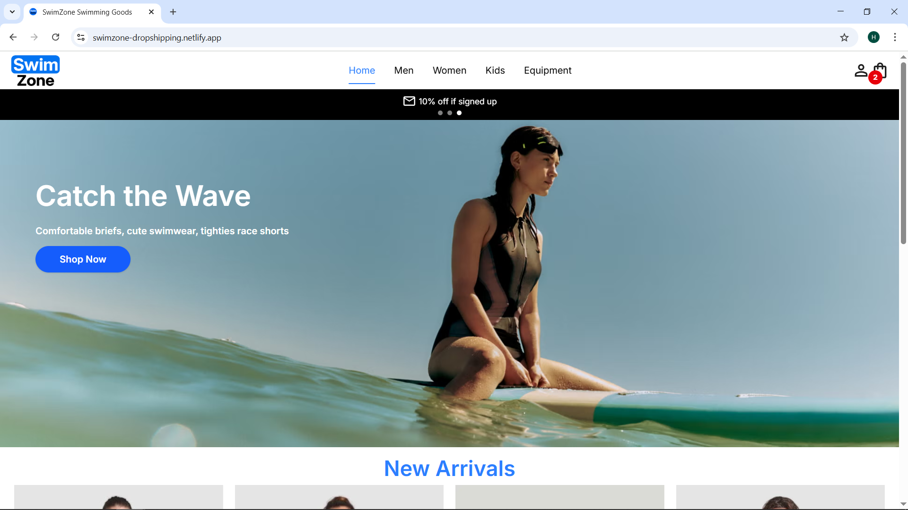
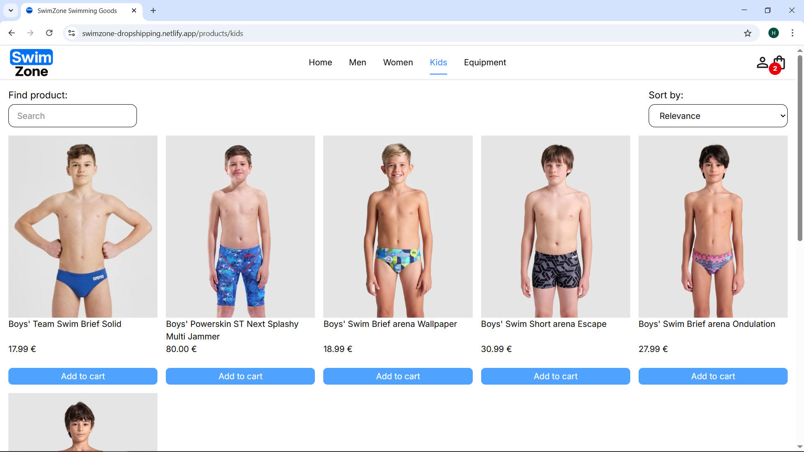
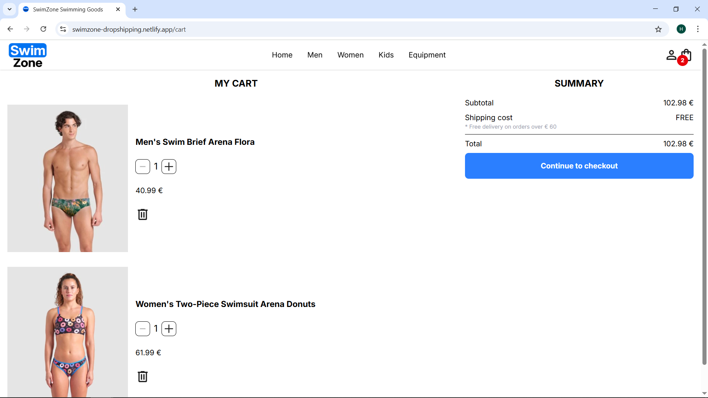
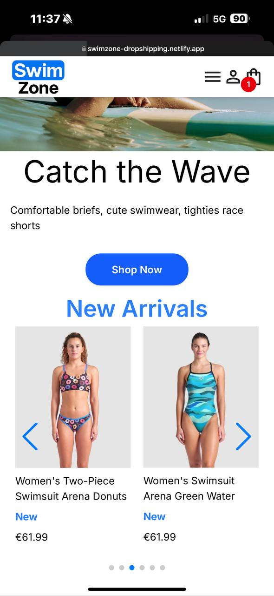

# 🏊 SwimZone — Dropshipping Website (React + Tailwind)

This is a fully responsive, modern dropshipping e-commerce website built using **React**, **Vite**, and **Tailwind CSS**. It features dynamic product rendering, category-based routing, mobile-optimized design, and global cart functionality with persistent storage — all designed to deliver a smooth, real-world online shopping experience.

📍 **[Live Demo →](https://swimzone-dropshipping.netlify.app/)**  
📁 **[GitHub Repository](https://github.com/HlebBusko/DropShippingMain)**

---

## 🚀 Key Highlights

- ✅ **Responsive Design** — Mobile-first layout with optimized UX for all devices
- 🧭 **Dynamic Routing** — Built with React Router and route parameters for category/product pages
- 🛒 **Shopping Cart** — Fully functional, globally accessible, and persists in localStorage
- 🔐 **Login & Register Forms** — Frontend authentication pages with validation, UI feedback, and password toggle
- 🖼️ **Image Display Logic** — Grid layout on desktop, Swiper.js slider on mobile for product galleries
- ⚙️ **State Management** — Global state handled with React Context for both products and cart
- 🚀 **Deployed via Netlify** — Ready for production with Vite build optimization

---

## 🧱 Tech Stack

Frontend: React, Vite, Tailwind CSS  
Routing: React Router DOM  
State Management: React Context API  
UI Libraries: Swiper.js (product sliders), react-toastify, uuidv4  
Persistence: localStorage  
Deployment: Netlify

---

## 📂 Pages & Features

### 🏠 Home Page

- Hero section with branding and visuals
- Swiper slider featuring new products
- Simple footer with navigation links

### 🧢 Categories

- Men / Women / Kids / Equipment
- Category content dynamically rendered based on URL params
- Clean layout with consistent design across sections

### 📦 Product Detail Page

- Unique route per product (`/category/:id`)
- **Desktop**: Grid of product photos
- **Mobile**: Swipeable gallery powered by Swiper.js

### 🔐 Login & Register Pages

- Frontend-only (no backend)
- Field validation with real-time error feedback
- Show/hide password toggle
- Confirmation messages on successful submission

### 🛒 Cart Functionality

- Add, remove, and update items quantity
- Cart state stored globally and synced to localStorage
- Cart accessible from any page

---

## 💻 Local Setup

```bash
git clone https://github.com/HlebBusko/DropShippingMain.git
cd dropShip
npm install
npm run dev
```

## 📚 Project Objectives

This project was built as a **portfolio-ready frontend showcase**, simulating a real-world e-commerce platform:

- 🔧 Build scalable UI using reusable React components
- 🧭 Implement dynamic page generation via React Router
- 🛒 Handle global state and persistent cart functionality
- 📱 Ensure pixel-perfect responsiveness for mobile and desktop
- 🎨 Design with UX/UI best practices to mimic a modern storefront

---

## 📸 Preview

> Add 3–5 screenshots inside the `assets/` folder and reference them like this:

  
  
  


---

## 🤝 About Me

I'm a **professional swimming coach** pursuing a career in **frontend development**.  
This project reflects how I design user interfaces, manage application logic, and bring real products to life with responsive, interactive components.

## Contact me

- 📧 **Email**: [hleb.busko@gmail.com](mailto:hleb.busko@gmail.com)
- 📞 **Phone**: +48 796 746 210
- 🌐 **Portfolio**: https://portfoliohleb.netlify.app/
- 📍 **Based** in Warsaw, Poland
- 🗣 Fluent in English & Polish | Native Russian speaker
